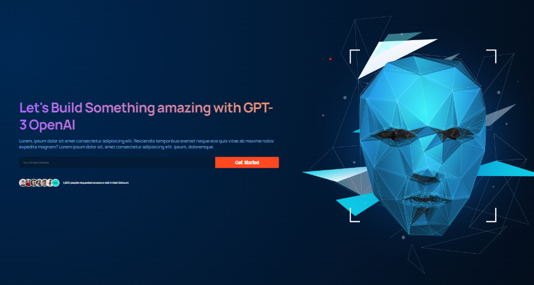

# GPT-3

## Introduction

This is a ReactJs project from [JS Mastery](https://www.jsmastery.pro/) tutorial video.
I this project to learn about ReactJs.
I was able to learn about:

- React Functional components and their reusability
- React file and folder structure
- Fundamental CSS properties to master flex & grid
- Fundamentals of the CSS BEM Model
- From soft and pleasant animations to complex gradients
- Perfectly placed media queries for satisfactory responsiveness covering almost devices
- And at the end you'll learn how to deploy your websites to extremely fast servers and give them a custom domain name.

### Desktop preview

